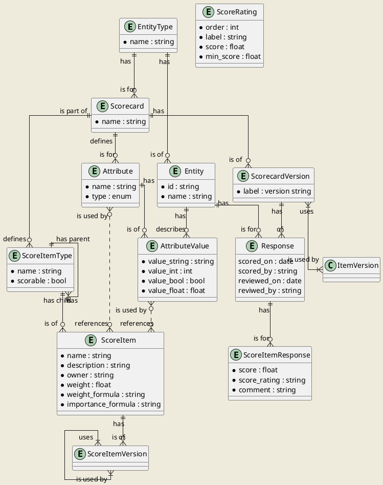

ER diagram of the scorch model.

A Scorecard is the central focus if scorch. Scorecards define a collection
of ScoreItems, which are the things that people evaluate to create a score.
ScoreItemTypes are organized in to a hierachy for a given Scorecard.

For example, for Scorecard used for an application EntityType, the
ScoreItemTypes might be:

- Objective: a high-level business goal for every application. Examples include
Safety, Flexibility, and Cost-Effectiveness
    - Principle: a characteritic of applications that achieve the parent
Objective. For example, Secure might be a Principle under Safety.
        - Directive: a way that an application achieves the characteristic
stated in the Principle. A directive might state something like,
"Scan code for vulnerabilities."
            - Rule: a scorable statement about the application.

Entities are the architectural entities being scored by a Scorecard.
Each entity type can have multiple Scorecards

After